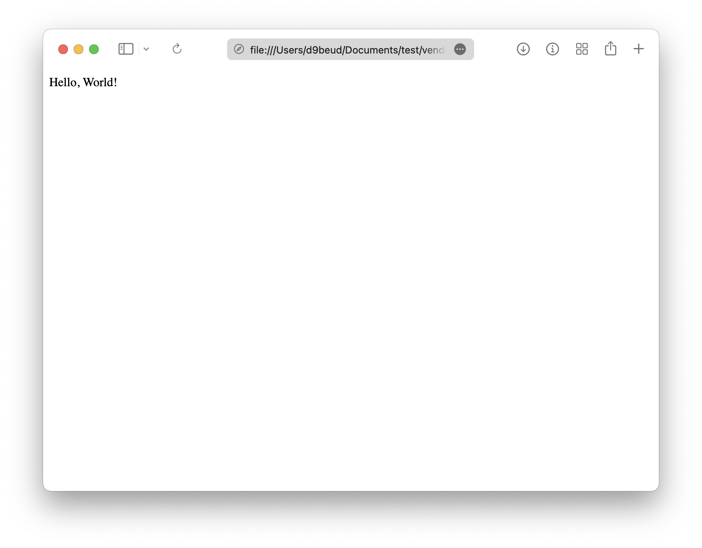
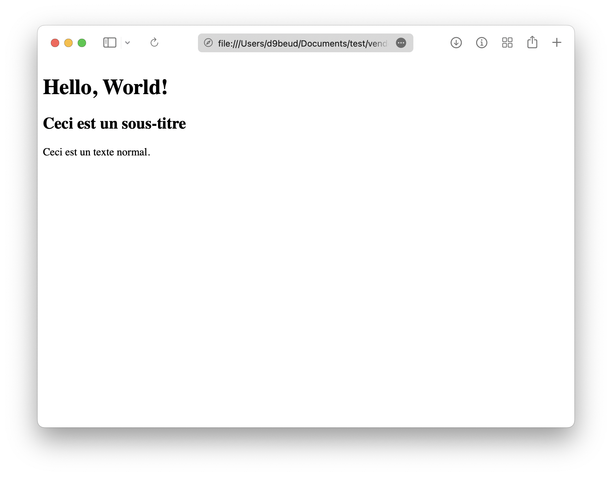

# La syntaxe

Quand on regarde une page web, il faut imaginer l'ensemble des éléments comme une arborescence de blocs imbriqués les uns dans les autres. Par exemple, un texte est imbriqué dans un paragraphe, lui-même imbriqué dans un article, lui-même imbriqué dans le corps de la page web.

## Représenter les balises

Pour représenter les blocs sous forme de code, on utilise ce que l'on appelle les **balises** ; vous les avez aperçues dans [l'introduction](./#preparer-son-environnement-de-travail). C'est un mot clé entouré de chevrons `<` et `>`. Il existe les balises **ouvrantes** et les balises **fermantes** qui permettent de coder de nouveaux éléments entre les deux (exemple : `<html>` et `</html>`).

::: info
Quelques rares éléments n'ont pas besoin d'avoir de balises fermantes : ce sont les balises **auto-fermantes** qui seront abordées plus tard dans ce cours.
:::

## Le DOCTYPE

Le langage HTML existe depuis 1993. Heureusement, sa norme a depuis évoluée de nombreuses fois. La norme actuelle est appelée *HTML5* et est celle traitée dans ce cours.

Pour indiquer au navigateur que le document interprété suit la norme *HTML5*, on fait recours au **DOCTYPE**. C'est la première balise apparaissant au début du document `.html`.

```html
<!DOCTYPE html>
```

Cette balise est unique en son genre puisqu'elle commence par `<!` au lieu de `<` uniquement. Le type du document, ici `html`, est placé en tant qu'attribut.

::: tip
:speech_balloon: ***Que se passerait-il si j'oubliais de mettre le DOCTYPE dans mon document ?***

Eh bien... Rien ! Par défaut, les navigateurs actuels interprètent le HTML comme étant sous la norme HTML5. Il est cependant important de suivre les standards et donc de préciser le DOCTYPE.
:::

## La structure

Toutes les pages web ont la même structure de base. Elles commence par un [DOCTYPE](#le-doctype) suivi d'une balise `<html>`.

```html{2,4}
<!DOCTYPE html>
<html>
	...
</html>
```

À l'intérieur des balises `<html>`, on place deux nouvelles balises : `<head>` recueillera les métadonnées de la page et `<body>` aura le contenu de la page.

```html{3-4}
<!DOCTYPE html>
<html>
  <head></head>
  <body></body>
</html>
```

::: info
Si vous rafraichissez votre page web maintenant, vous aurez toujours une page blanche. C'est normal, la partie visible de votre page web sera dans le `<body>`. C'est pour bientôt, promis !
:::

## Les balises HTML5

Plusieurs balises *HTML5* ont été définies par l'organisation [WHATWG](https://fr.wikipedia.org/wiki/Web_Hypertext_Application_Technology_Working_Group) dont le travail a été repris par le [W3C](https://fr.wikipedia.org/wiki/World_Wide_Web_Consortium). En voici une sélection non exhaustive :

- `<main>` : Définit le contenu principal de la page, théoriquement unique sur la page.
- `<article>` : Définit une zone indépendante de la page comme un article ou un commentaire.
- `<header>` : Définit un entête de page et ton contenu. :warning: Attention à ne pas la confondre avec la balise `<head>`.
- `<footer>` : Définit le pied de page et son contenu.
- `<div>` : Défini une division de la page. C'est l'élément le plus utilisé dans un document HTML.

Si chaque balise a un rôle qui lui est propre, c'est en partie pour aider les logiciels d'assistance pour personnes malvoyantes à dicter de manière précise le contenu des pages visitées. Les moteurs de recherche se basent aussi sur ces balises pour mieux indexer votre site et le proposer dans des résultats de recherche pertinents.

## La typographie

Il est temps d'ajouter du contenu à notre première page web en partant de la base que nous venons de voir.

```html
<!DOCTYPE html>
<html>
  <head></head>
  <body></body>
</html>
```

Si l'on écrit simplement du texte à l'intérieur de la balise `<body>` et que l'on rafraichit la page, le texte doit s'afficher. Il était temps !

```html{5}
<!DOCTYPE html>
<html>
  <head></head>
  <body>
    Hello, World!
  </body>
</html>
```



::: tip
:speech_balloon: ***Mais il est tout petit mon texte ! Je le voudrais plus grand.***

Quelle impatience, j'y viens.
:::

Notre petit texte va s'imposer en se transformant en titre. Pour cela, nous auront besoin d'une balise `<h>` suivi d'un numéro allant d'un 1 à 6 (`<h1>`, `<h2>`, `<h3>`, `<h4>`, `<h5>` et `<h6>`). Ce numéro représente le niveau d'importance du titre, 1 étant le plus important et 6 le moins important. En règle générale, les navigateurs affichent les titres les plus importants plus grand que les moins important.

```html{5-7}
<!DOCTYPE html>
<html>
  <head></head>
  <body>
    <h1>Hello, World!</h1>
    <h2>Ceci est un sous-titre</h2>
    Ceci est un texte normal.
  </body>
</html>
```



Nous pouvons aussi représenter notre texte normal en tant que paragraphe grâce à la balise `<p>`.

```html{7}
<!DOCTYPE html>
<html>
  <head></head>
  <body>
    <h1>Hello, World!</h1>
    <h2>Ceci est un sous-titre</h2>
    Ceci est un texte normal.
  </body>
</html>
```

Pour formater le texte en mettant des mots en **gras** ou en *italique*, nous pouvons utiliser respectivement les balises `<b>` (comme "bold" en anglais) ou `<i>`.

```html{5-7}
<!DOCTYPE html>
<html>
  <head></head>
  <body>
    <p>
      Voici du texte en <b>gras</b>, en <i>italique</i> ou <b><i>les deux</i></b>
    </p>
  </body>
</html>
```

::: info
Jusque-là, toutes les balises que nous avions vues étaient des balises dites "bloc", elles prennent toute la largeur de la page. Au contraire, les balises `<b>` et `<i>` sont dites "en ligne" car elles ne font qu'entourer du texte.
:::

## Les attributs

Les attributs sont des paramètres pouvant être ajoutés à une balise. Ils sont indispensables pour ajouter un lien sur un mot ou préciser la source d'une image.

On les retrouve à l'intérieur d'une balise ouvrante ou auto-fermante. Pour un lien (parfois appelé "ancre"), on utilise la balise en ligne `<a>` et on lui ajoute l'attribut `href`. Pour une image, c'est la balise auto-fermante `` et l'attribut `src`.

```html
<a href="exemple.com/lien">Ceci est un lien</a>

```

::: warning
Les attributs `src` et `alt` sur la balise `` sont **obligatoires**. L'attribut `alt` doit contenir la description de l'image qui sera lue par les robots assistants des personnes malvoyantes et affichée si le chargement de l'image est en échec.
:::
